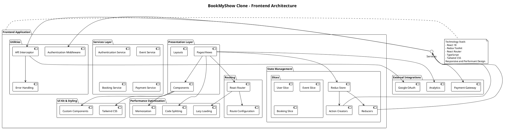

# Software Design Description (SDD) for BookMyShow Clone

---

## 1. Introduction

### 1.1 Purpose
This **Software Design Description (SDD)** outlines the design for a **BookMyShow Clone**, an online ticket booking platform. The document describes the architecture, components, interfaces, and their interactions, ensuring the system meets functional and non-functional requirements.

---

### 1.2 Scope
The BookMyShow clone system enables users to:
- **Browse** events, movies, and shows.
- **Book tickets** and manage bookings.

The platform supports:
- **Web and mobile applications** for user convenience.
- **Backend services** for efficient processing.
- **Payment gateways** for secure transactions.
- **External integrations** (e.g., cloud hosting, geolocation APIs, analytics tools).

---

### 1.3 Design Goals
The design aims to achieve the following objectives:
- **Scalable** and **reliable** ticket booking system.
- **Seamless user experience** for searching and booking.
- **Robust payment security** mechanisms.
- **Effective event management** tools for organizers.
- Support for **high traffic** during peak loads.

---

### 1.4 Architectural Principles
The design adheres to the following principles:
- **Microservices architecture** for modularity and scalability.
- **Event-driven design** for real-time notifications and updates.
- **Loose coupling** between services for flexibility.
- **Containerized deployment** for consistent environments.
- **Cloud-native implementation** for high availability.

---

## 2. System Architecture

### 2.1 Architecture Overview
The **BookMyShow Clone** employs a distributed, microservices-based architecture comprising the following layers:

---

#### **Presentation Layer**
- **React.js** for web applications.
- **React Native** for mobile applications.
- **Server-side rendering (SSR)** for faster initial page loads.
- **Progressive Web App (PWA)** support for offline functionality.

---

#### **Application Layer**
- Microservices built using **Node.js** and **Express**.
- RESTful and **GraphQL APIs** for flexible interaction.
- **Event-driven communication** via Kafka or RabbitMQ.
- **Authentication services** using OAuth2 and JWT.

---

#### **Data Layer**
- **Primary Database**: PostgreSQL for structured data (users, bookings).
- **Caching**: Redis for faster queries (e.g., seat availability).
- **Search Engine**: Elasticsearch for event/movie search and filtering.
- **File Storage**: Cloud storage for banners, event details, and invoices.

---

## 3. System Capabilities

### 3.1 Advanced Features

---

#### **3.1.1 Machine Learning Integration**
- **Personalized recommendations** for events and movies.
- **Dynamic pricing** for high-demand events.
- **User behavior analytics** for better targeting.
- **Fraud detection** for ticket bookings.

---

#### **3.1.2 Real-time Capabilities**
- Real-time **seat booking status** and availability.
- **Notifications** for ticket confirmations, cancellations, and offers.
- Real-time streaming for **virtual events** or movie premieres.

---

#### **3.1.3 Payment Integration**
- Integration with gateways like **Razorpay, PayPal, Stripe**.
- Secure processing with **PCI compliance**.
- Support for **multiple currencies** and payment methods.

---

#### **3.1.4 Geolocation and Personalization**
- **Geolocation APIs** for local event suggestions.
- **Language preferences** for personalized content.

---

#### **3.1.5 Event Organizer Features**
- Dashboards for tracking **ticket sales** and revenue.
- Tools for **event setup** and **seat management**.
- Analytics for **audience demographics** and preferences.
---

### **3.2 Activity Diagrams**

#### **3.2.1 User Browsing and Booking Tickets**  
This activity diagram illustrates the step-by-step process a user follows while searching for events or movies, selecting seats, and completing the booking process. It also covers scenarios where no search results are found or seats are unavailable.  

**UML Diagram:**  


---

#### **3.2.2 Event Organizer Adding an Event**  
This diagram represents the workflow for event organizers to add a new event. It includes steps like providing event details, uploading media assets, setting ticket types and prices, and publishing the event for user visibility.  

**UML Diagram:**  


---

#### **3.2.3 Payment Process**  
This diagram outlines the payment process flow. It highlights the steps users follow to complete the payment, along with handling both successful and failed payment scenarios.  

**UML Diagram:**  


---

#### **3.2.4 Real-time Seat Booking Status Update**  
This diagram explains the real-time mechanism for seat availability updates. It depicts how a user queries seat status and how the backend processes and returns real-time updates.  

**UML Diagram:**  


---

#### **3.2.5 Personalized Event Recommendations**  
This diagram showcases the process for generating personalized event recommendations. It demonstrates how user preferences and behavior are analyzed to suggest tailored events or movies.  

**UML Diagram:**  


---

## 4. Module Design

### 4.1 Frontend Architecture


---
### 4.1.1 Architectural Overview
- **Modular Component-Based Design**: Utilizing React/Next.js for scalable frontend architecture  
- **Responsive Design**: Adaptive layout for web and mobile platforms  
- **State Management**: Implementing Redux/Context API for global state management  
- **Performance Optimization**: Code splitting, lazy loading, and efficient rendering .
--- 
### 4.1.2 User Interface Modules

#### 1. Authentication Module
- Login/Registration interfaces  
- Social media authentication  
- Password recovery workflows  
- Multi-factor authentication support  

#### 2. Content Discovery Module
- Personalized recommendation grid  
- Trending and categorized content sections  
- Advanced search and filtering mechanisms  
- Content carousel and horizontal scrolling views  

#### 3. Video Interaction Module
- Adaptive video player  
- Interactive engagement tools (likes, comments, shares)  
- Fullscreen and Picture-in-Picture modes  
- Quality and playback speed controls  

#### 4. User Profile Module
- Comprehensive profile management  
- Content upload capabilities  
- Watch history and saved playlists  
- Channel customization options
---
### 4.1.3 Client-Side Processing
- **Local Caching**: Implementing browser storage for performance  
- **Offline Support**: Service worker integration  
- **Real-time Updates**: WebSocket connections for live interactions  
- **Error Boundary Management**: Graceful error handling and user notifications  

---

## 4.2 Backend System Architecture


```plantuml
@startuml
!define DARKBLUE
!includeurl https://raw.githubusercontent.com/Argonaut-B04/PlantUML-style-C4/master/style.puml

title Spotify Clone - Backend System Architecture

frame "Frontend Layer" {
    [Web Client] as WebClient
    [Mobile Client] as MobileClient
}

cloud "API Gateway" {
    [Nginx / Kong API Gateway] as APIGateway
}

frame "Authentication Services" {
    [Authentication Service] as AuthService
    database "User Database" {
        [MongoDB - User Profiles] as UserDB
    }
}

frame "Music Processing Microservices" {
    [Music Upload Service] as UploadService
    [Music Encoding Service] as EncodingService
    [Thumbnail Generation Service] as ArtworkService
    
    database "Music Metadata DB" {
        [PostgreSQL - Music Metadata] as MusicMetadataDB
    }
    
    storage "Music Storage" {
        [Distributed File Storage] as MusicStorage
    }
}

frame "Content Delivery" {
    [CDN Service] as CDN
}

frame "Content Services" {
    [Music Recommendation Service] as RecommendationService
    [Search Service] as SearchService
    [Analytics Service] as AnalyticsService
    
    database "Redis Caches" {
        [Playlist Cache] as PlaylistCache
        [Recommendation Cache] as RecommendCache
    }
    
    database "Elasticsearch" {
        [Music Search Index] as SearchIndex
    }
}

frame "Social Interaction Services" {
    [Like/Share Service] as LikeShareService
    [Playlist Interaction Service] as PlaylistService
    database "Interaction Database" {
        [Cassandra - Likes/Comments] as InteractionDB
    }
}

frame "Monetization Services" {
    [Monetization Service] as MonetizationService
    database "Billing Database" {
        [PostgreSQL - Earnings] as BillingDB
    }
}

frame "Message Queues & Event Streaming" {
    [Apache Kafka] as EventBus
    [RabbitMQ] as MessageQueue
}

frame "Monitoring & Observability" {
    [Prometheus] as Monitoring
    [Grafana] as Dashboard
    [ELK Stack] as Logging
}

' Connections
WebClient --> APIGateway
MobileClient --> APIGateway

APIGateway --> AuthService : Authentication
APIGateway --> UploadService : Music Upload
APIGateway --> LikeShareService : Likes/Share
APIGateway --> PlaylistService : Playlist Management

AuthService --> UserDB : Store/Retrieve Users
AuthService --> EventBus : User Events

UploadService --> MusicStorage : Store Music
UploadService --> EncodingService : Trigger Encoding
UploadService --> MusicMetadataDB : Store Metadata
UploadService --> EventBus : Upload Events

EncodingService --> ArtworkService : Generate Artwork
EncodingService --> MusicStorage : Store Processed Music
EncodingService --> EventBus : Encoding Events

RecommendationService --> SearchIndex
RecommendationService --> RecommendCache
RecommendationService --> EventBus : Recommendation Events

LikeShareService --> InteractionDB : Store Likes/Comments
LikeShareService --> EventBus : Like Events

PlaylistService --> PlaylistCache : Update Playlist
PlaylistService --> EventBus : Playlist Events

CDN --> MusicStorage : Distribute Content

SearchService --> SearchIndex : Update/Query Search
SearchService --> EventBus : Search Events

AnalyticsService --> EventBus : Consume Events
AnalyticsService --> Monitoring : Report Metrics

MonetizationService --> BillingDB : Track Earnings
MonetizationService --> EventBus : Monetization Events

EventBus <--> MessageQueue : Event Routing

Monitoring --> Logging : Collect Logs
Monitoring --> Dashboard : Visualize Metrics

@enduml
```
# BookMyShow Clone System Design

---

## 4.2.1 Distributed Service Ecosystem
- **Microservices Architecture**: Independently scalable services  
- **Event-Driven Communication**: Kafka/RabbitMQ for inter-service messaging  
- **Service Discovery**: Consul/Kubernetes for dynamic service registration  

---

## 4.2.2 Authentication and Security Layer

### 1. Identity Management
- JWT-based authentication  
- Role-based access control  
- OAuth 2.0 and OpenID Connect support  
- Passwordless authentication options  

### 2. Security Mechanisms
- Encrypted token storage  
- Brute-force protection  
- Cross-Site Scripting (XSS) prevention  
- SQL injection safeguards  

---

## 4.2.3 Content Management Services

### 1. Event Processing Service
- Event transcoding and metadata extraction  
- Adaptive bitrate streaming  
- Event artwork (poster) generation  
- Metadata extraction for events  
- Content moderation  

### 2. Storage Management
- Distributed file storage (AWS S3/Google Cloud Storage)  
- Content Delivery Network (CDN) integration  
- Efficient storage tiering  
- Backup and disaster recovery  

---

## 4.2.4 Recommendation and Discovery Engine

### 1. Machine Learning Models
- Collaborative filtering  
- Content-based recommendation  
- Hybrid recommendation algorithms  
- User behavior analysis  

### 2. Personalization Mechanisms
- Real-time preference tracking  
- Contextual recommendation  
- A/B testing recommendation strategies  
- Diversity and serendipity in suggestions  

---

## 4.2.5 Interaction and Engagement Services

### 1. User Interaction Tracking
- Like, comment, and share mechanisms  
- Notification dispatch system  
- Engagement metrics collection  
- Community interaction workflows  

### 2. Social Features
- Follow/subscribe functionality  
- User-generated playlists  
- Community content curation  
- Collaborative experiences for users  

---

## 4.3 Cross-Cutting Concerns

### 4.3.1 Observability and Monitoring
- Distributed tracing  
- Performance metrics collection  
- Log aggregation  
- Real-time alerting systems  

### 4.3.2 Scalability Strategies
- Horizontal service scaling  
- Load balancing  
- Caching mechanisms  
- Auto-scaling configuration  

### 4.3.3 Compliance and Privacy
- GDPR compliance  
- Data anonymization  
- User consent management  
- Transparent data handling  

---

## 4.4 Advertising Ecosystem

### 4.4.1 Ad Targeting Strategy
- Demographic-based targeting  
- Interest and behavior profiling  
- Geographic location targeting  
- Device-specific ad delivery  

### 4.4.2 Ad Placement Types

#### 1. Video Ad Formats
- Pre-roll ads  
- Mid-roll ads  
- Post-roll ads  
- Overlay advertisements  

#### 2. Additional Placement Channels
- Sidebar recommendations  
- Banner advertisements  
- Sponsored content sections  

### 4.4.3 Revenue Generation
- Impression-based pricing (CPM)  
- Performance-based pricing (CPC)  
- Revenue sharing with content creators  
- Conversion tracking  

### 4.4.4 Compliance and User Experience
- User ad preference settings  
- Opt-out mechanisms  
- Ad frequency capping  
- Content moderation  
- Brand safety filters  

### 4.4.5 Technical Infrastructure
- Low-latency ad delivery  
- Real-time bidding integration  
- Fraud detection mechanisms  
- Cross-platform ad compatibility  

### 4.4.6 Advertiser Tools
- Self-service ad creation platform  
- Campaign management dashboard  
- Performance analytics  
- A/B testing capabilities
---
## 5. Database Design

The BookMyShow clone uses a combination of SQL and NoSQL databases. Below is the schema for major entities:

- **Users**: Stores user information like username, email, and preferences.
- **Events**: Stores event details, such as name, date, venue, and ticket availability.
- **Bookings**: Stores booking information, including seat selection and payment status.
- **Playlists**: Stores playlist information, including user-created playlists and shared playlists.
- **Comments**: Stores user comments and feedback for events and movies.
- **Interactions**: Tracks likes, views, and shares related to events and movies.
- **Subscriptions**: Tracks user subscriptions to events or premium features.


```plantuml
@startuml
!define DARKBLUE
!includeurl https://raw.githubusercontent.com/Argonaut-B04/PlantUML-style-C4/master/style.puml
// Event Interaction Use Cases
usecase "Browse Events" as BrowseEvents
usecase "Book Ticket" as BookTicket
usecase "Leave Feedback" as LeaveFeedback

// Playlist Interaction Use Cases
usecase "Create Playlist" as CreatePlaylist
usecase "Add Event to Playlist" as AddToPlaylist
usecase "Remove Event from Playlist" as RemoveFromPlaylist

// Search and Discovery
usecase "Search Events" as SearchEvents
usecase "Recommended Events" as Recommendations
usecase "Browse Genres" as BrowseGenres

// Monetization
usecase "Enable Monetization" as Monetize
usecase "View Earnings" as ViewEarnings

// Admin Use Cases
usecase "Content Moderation" as Moderation
usecase "User Management" as UserManagement
usecase "Platform Settings" as PlatformSettings

// Relationships
Visitor --> BrowseEvents
Visitor --> SearchEvents
Visitor --> Login
Visitor --> Register

User --> Login
User --> BrowseEvents
User --> BookTicket
User --> LeaveFeedback
User --> SearchEvents
User --> CreatePlaylist
User --> AddToPlaylist
User --> RemoveFromPlaylist
User --> Recommendations
User --> ManageProfile

Creator --> CreateEvent
Creator --> EditEvent
Creator --> DeleteEvent
Creator --> CreatePlaylist
Creator --> BrowseGenres
Creator --> Monetize
Creator --> ViewEarnings

Admin --> Moderation
Admin --> UserManagement
Admin --> PlatformSettings
@enduml
```
---
## 7. Non-Functional Requirements

### 7.1 Performance
- **Support for 100,000 simultaneous users** with peak load handling.
- Maximum **ticket booking time**: 2 seconds for fast ticket processing.
- **Real-time seat availability** updates with a response time under 1 second.
- **Content delivery network (CDN)** response time under 50 milliseconds for quick loading of event images and media.
- Efficient resource utilization with **less than 70% CPU** and memory load during peak traffic.
- Support for **4K resolution streaming** for virtual events, if applicable.

---

### 7.2 Scalability
- **Horizontal scaling** capabilities for all backend services to handle large spikes in traffic.
- **Microservices architecture** enabling independent scaling of each service (e.g., ticketing, user management, event discovery).
- **Automatic horizontal scaling** based on real-time traffic metrics.
- **Multi-region deployment** for high availability and low latency.
- **Containerization** using **Docker** and **Kubernetes** for seamless scaling.
- **Load balancing** across multiple server instances to ensure even distribution of traffic.
- **Elastic database scaling** with **read replicas** and **sharding mechanisms** for scalable data storage.

---

### 7.3 Availability
- **99.9% system uptime guarantee**, ensuring the platform is always accessible for users.
- **Redundant component architecture** to eliminate single points of failure.
- **Multi-region failover support** for uninterrupted access in case of regional outages.
- **Automatic service recovery mechanisms** to handle and restore failed services quickly.
- **Zero-downtime deployments** to ensure uninterrupted service during software updates.
- **Real-time health monitoring** and automatic service restoration to maintain system stability.
- **Geographically distributed data centers** for continuous operation and low-latency access.

---

### 7.4 Security
- **End-to-end encryption** for all sensitive data.
- **Multi-factor authentication** for users.
- **Role-based access control (RBAC)** for secure role assignment.
- Comprehensive **input validation** and sanitization to prevent malicious input.
- Protection against common web vulnerabilities:
  - SQL injection
  - Cross-site scripting (XSS)
  - Cross-site request forgery (CSRF)
- Regular **security audits** and **penetration testing** to identify potential risks.
- **Compliance with international data protection regulations** (e.g., GDPR, CCPA).
- Secure **API design** with **token-based authentication**.
- **Advanced threat detection** and prevention mechanisms.

---

### 7.5 Reliability
- **Automatic error detection** and logging for proactive issue resolution.
- **Graceful error handling** to ensure smooth user experience even during failures.
- **Circuit breaker pattern** to prevent cascading failures.
- Comprehensive **monitoring** and **alerting systems** to detect and respond to issues in real-time.
- Detailed **performance and error reporting** to track and resolve issues.
- **Automatic rollback** of problematic deployments to ensure minimal service disruption.

---

### 7.6 Compliance
- **GDPR compliance** for user data protection.
- **CCPA data privacy regulations** for California-based users.
- **COPPA guidelines** for content involving minors.
- **Accessibility standards** (WCAG 2.1) for users with disabilities.
- **Transparent data usage policies** to inform users about data handling.
- **User consent management** for data collection and processing.
- **Right to be forgotten** implementation for user data deletion requests.

---

## 8. Conclusion
This comprehensive **Software Design Description** provides a thorough blueprint for a robust, scalable, and user-centric ticket booking platform. By leveraging modern architectural principles, microservices design, and advanced technologies, the **BookMyShow Clone** is engineered to:

- Handle massive concurrent user loads during peak traffic times.
- Provide seamless and responsive user experiences across web and mobile platforms.
- Ensure **high availability** and **performance** for uninterrupted access to events.
- Maintain stringent **security** and **privacy** standards for user data.
- Support future technological innovations such as **real-time streaming**, **personalized recommendations**, and **dynamic pricing**.

The modular design allows for independent scaling of components, while strategic integration with external services enables efficient content delivery, user engagement, and analytics. The platform is not just a clone but a sophisticated, adaptable solution capable of competing in the dynamic entertainment and ticket booking market.

### Key Differentiators include:
- Flexible **microservices architecture** for scalable operations.
- Advanced **machine learning** for personalized event recommendations and dynamic pricing.
- **Robust security** and compliance frameworks.
- **Scalable infrastructure** for handling high user traffic.
- **Real-time interaction capabilities** for live events and notifications.

Continuous improvement, regular **performance optimizations**, and staying aligned with emerging technologies will be critical to the platform's long-term success and user satisfaction.

